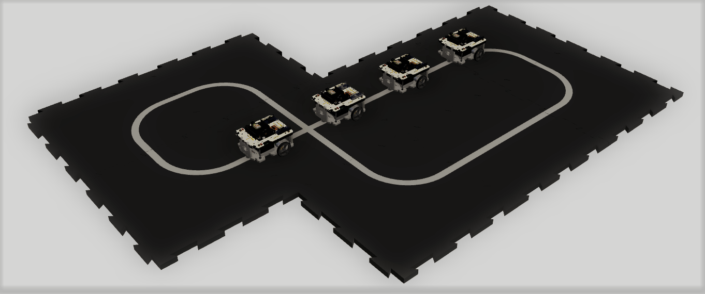
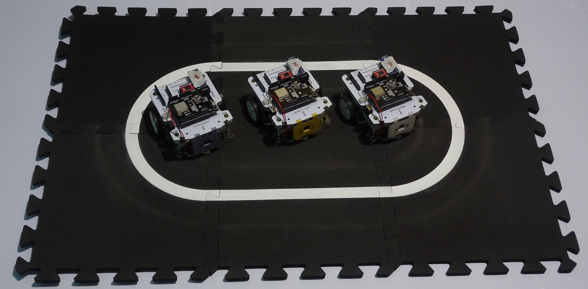
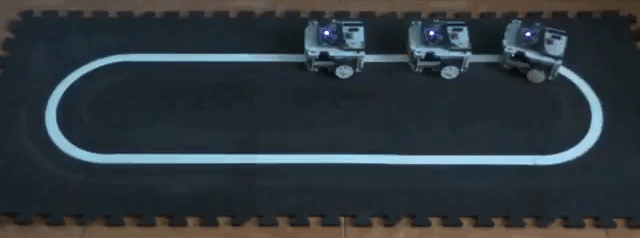

# openPMA: Plataforma experimental multi-agentes
Repositorio de la plataforma experimental multi-agentes
## Descripcion de la plataforma

La plataforma experimental consta de tres partes fundamentales:

- Superficie de navegacion modular
- Trayectoria de navegacion
- Flota de robots mobiles

La superficie es de goma eva, para esta aplicacion se utiliza en color negro, y tiene la capacidad de montarse y desmontarse con facilidad.
Por otra parte, la trayectoria de navegacion corresponde a un segmente continuo, pintado en color blanco sobre la superficie.
Finalmente, la flota de robots moviles esta compuesta por robots de traccion diferencial (DDMR) identicos, los cuales, tienen la capacidad de seguir trayectorias abiertas o cerradas; mantener una distancia fija respecto a su robot predecesor; seguir referencias de velocidad; comunicarse con otros agentes utilizando el protocolo de comunicacion UDP a traves de un punto de acceso WiFi; entre otras.

## Prueba de Funcionamiento

En este video se realiza una prueba de funcionamiento de la plataforma experimental. Ademas, muestra la capacidad de los robots de navegar de forma cooperativa. El video completo se puede ver en:
https://youtu.be/nR3WdcdglEQ

